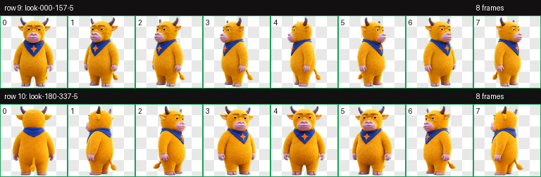

# 我给 Codex 做了一只“大星牛来”，顺手把制作方法开源成了 Skill

最近我在 GitHub 看到一个项目：[codex-niulai-pet](https://github.com/ztidal/codex-niulai-pet)。

作者把“牛来”做成了 Codex 桌面端的动态宠物。它会待机、走路、挥手、跳跃；Codex 工作、等待确认、审阅结果时，它也会跟着换动作。

这东西对写代码没有任何决定性帮助，但我看完只剩一个想法：我也要一只。

不过我不想只下载别人的成品。我想做一只属于“大星AI”的牛来，再把整套方法做成 Skill。以后别人丢一张自己的角色图给 Codex，也能孵出一只可以安装的桌面宠物。

于是有了“大星牛来”。


它还是芥末黄色的毛、深紫色的角、粉紫色的大嘴，眼神也保留了那种淡定又有点荒诞的味道。我给它加了一条钴蓝色三角领巾，中间缝了一颗橙色四角星。

这是我给它留下的个人标记。

## 一张牛图很容易，同一只牛的 88 个动作很难

我一开始以为，做 Codex 宠物无非是生成一张图，再切成几个动作。

真正拆开以后，事情没这么简单。

我在当前 Mac 上安装的 ChatGPT/Codex `26.810.52044` 里核对了宠物加载逻辑。Codex 同时识别两套精灵表：旧版是 9 行，新版 v2 是 11 行。我要做的是 v2：

- 8 列 × 11 行；
- 每格 192×208；
- 整张图 1536×2288；
- 前 9 行是待机、左右移动、挥手、跳跃、失败、等待、工作、审阅；
- 最后 2 行放 16 个观察方向；
- 没用到的格子必须完全透明；
- `pet.json` 里要明确写 `spriteVersionNumber: 2`。

一张完整精灵表有 88 个格子。让模型一次性把 88 格全部画完，角色很容易在中途换脸、换体型、漏掉配件，甚至直接把参考图裁成 88 块。

所以我没有让 Codex“一次生成整张图”。

我先让它生成一张角色基准图，锁定牛角、口鼻、毛发、眼神、领巾和四角星。然后逐行生成动作：一行待机、一行右移、一行挥手……每一行都带上同一张基准图和对应的格子布局。

完整流程一共准备 12 个图像任务：1 张基准图，加 11 行动作图。



这样做慢一些，但有个很实际的好处：哪一行坏了，只重做哪一行。

## 图片生成只负责画，尺寸和透明交给脚本

AI 画出来“看着像”还不够。Codex 能不能加载，取决于另一套更死板的规则。

比如背景。

模型很喜欢给角色补一块地面、淡淡的投影或者光晕。单看图片，这些细节可能挺自然；切成桌面宠物以后，它们会变成一块块悬空的脏边。

我的做法是先根据参考图自动选择一个与角色主色距离足够远的纯色色键。这次选中的是纯青色 `#00FFFF`。模型每行都在青色底上生成，后面的脚本再统一去底、找出独立角色、切成 192×208 的单帧。

脚本还会继续检查：

- 应该有内容的格子是不是空的；
- 不该有内容的格子是不是真的透明；
- 角色有没有碰到单元格边缘；
- 是否残留与色键接近的像素；
- 完全透明的像素里是否还藏着 RGB 颜色；
- 每一行的帧数、尺寸和提取方式是否符合合同。

最后再把所有单帧拼成无损 WebP，生成总览图和每行动作 GIF。

这次“大星牛来”的最终文件是 `1536×2288`，11 行全部通过，自动检查没有错误和警告，透明像素的 RGB 残留为 0。成品 WebP 大约 2.3 MB。

但我仍然没有把脚本通过当成完成。

脚本能发现空帧和白底，发现不了“这只牛突然换了一张脸”。所以最后还要看一遍动作总览和 GIF：左右移动方向对不对，待机是不是太闹，工作状态有没有真的变成跑步，领巾和星星有没有在某一帧消失。

自动校验解决“装不装得上”，视觉校验解决“还是不是同一只”。

## 我把这套过程做成了一个 Skill

Skill 叫 [`make-codex-pet-v2`](https://github.com/diyewu/daxiing-skills/tree/main/make-codex-pet-v2)。

安装后，新开一个 Codex 任务，丢进参考图，直接说：

```text
使用 $make-codex-pet-v2，把这张角色图做成 Codex v2 动态宠物，名字叫“大星牛来”。
```

没有参考图也可以只写描述：

```text
使用 $make-codex-pet-v2，做一只圆滚滚的蓝色水獭 Codex 宠物，戴橙色围巾，风格像软胶玩具。
```

Skill 会先确定角色身份，再准备基准图、11 行动作提示词和布局图。图像生成结束后，它调用脚本完成切帧、透明化、拼图、校验和预览。

最后会交付这些文件：

```text
pet.json
spritesheet.webp
validation.json
review.json
contact-sheet.png
look-directions.png
previews/*.gif
```

如果你明确要求安装，它会把 `pet.json` 和 `spritesheet.webp` 放进：

```text
${CODEX_HOME:-$HOME/.codex}/pets/<pet-id>/
```

我这只已经安装在本机的 `daxing-niulai` 目录里。重新加载 Codex 后，就可以在宠物选择器里选“大星牛来”。

## 为什么我想开源的不是一张图

一张宠物精灵表很好玩，但它只能解决我的问题。

真正值得留下来的，是“怎么把一张角色图稳定地变成 Codex 宠物”这条流程：先锁身份，逐行生成，脚本校验，视觉复核，坏哪行修哪行。

这也很符合我现在使用 AI 的习惯。

我不太满足于拿到一次结果。只要一件事有第二个人可能会做，我就会想，能不能把它变成一条别人也能复用的工作流。

所以这次我得到的东西有两个：一只会在 Codex 旁边发呆、走路、等我确认的大星牛来；以及一个能继续孵出更多宠物的 Skill。

以后你的 Codex 旁边站着什么，就不必由默认列表决定了。

## 关于同人和开源边界

“大星牛来”是根据网络传播角色截图的视觉意象制作的非官方同人宠物，与相关影视作品的创作者、发行方、权利人或 OpenAI 都没有隶属、授权或背书关系。原始参考图不会放进开源目录。

`make-codex-pet-v2` 的代码采用 Apache License 2.0；示例精灵表的原创贡献部分采用 CC BY 4.0。这些许可证不授予第三方角色、名称、商标或参考图的权利。

自己在本地玩，和拿去做商业项目，是两件不同的事。后者请单独确认权利边界。

参考项目：[ztidal/codex-niulai-pet](https://github.com/ztidal/codex-niulai-pet)

开源 Skill：[diyewu/daxiing-skills/make-codex-pet-v2](https://github.com/diyewu/daxiing-skills/tree/main/make-codex-pet-v2)
