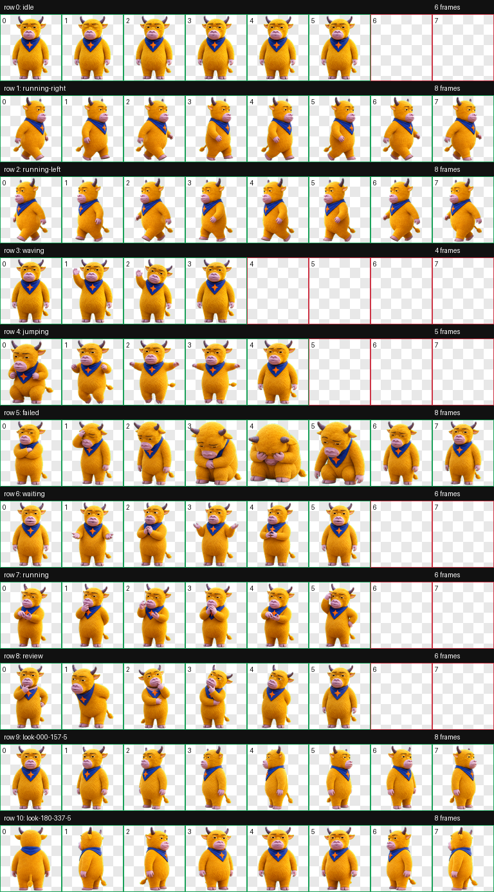
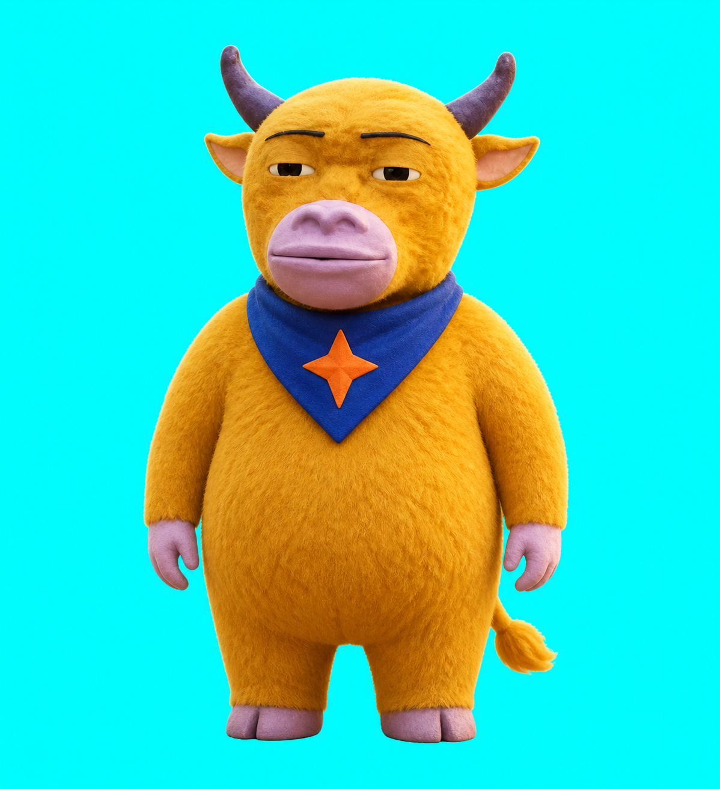

# 大星牛来

这是使用 [`make-codex-pet-v2`](../../make-codex-pet-v2/README.md) 从一张用户提供的“牛来”截图生成的 Codex v2 动态宠物样例。





生成时采用的角色基准提示词与动作条带策略收录在 [`generation-prompt.md`](generation-prompt.md)。

## 个人化设计

- 保留芥末黄色短绒毛、深紫色牛角、粉紫色宽口鼻和半眯眼神情。
- 新增钴蓝色三角领巾与橙色四角星布贴，作为“大星AI”的个人识别元素。
- 使用 3D 定格动画玩偶质感，缩小到 `192×208` 仍能辨认轮廓和配色。

## Codex v2 合同

- 8 列 × 11 行；
- 1536×2288；
- 9 组任务状态；
- 16 个观察方向；
- 透明 WebP；
- `spriteVersionNumber: 2`。

## 安装

把 `pet.json` 和 `spritesheet.webp` 一起复制到：

```text
${CODEX_HOME:-$HOME/.codex}/pets/daxing-niulai/
```

重新加载 Codex 后，在宠物选择器中选择“大星牛来”。

## 验证

`preview/validation.json` 的几何、透明和空单元格检查全部通过；`preview/review.json` 的 11 行切帧检查无错误和警告。`preview/contact-sheet.png`、`preview/look-directions.png` 和各行 GIF 用于发布前视觉复核。

## 非官方同人声明

这是根据用户提供的网络传播角色截图之视觉意象制作的非官方同人宠物，与相关影视作品的创作者、发行方、权利人或 OpenAI 均无隶属、授权或背书关系。原始参考图不收入本样例目录。角色名称和视觉意象可能受第三方权利保护；商业使用前请自行确认。
